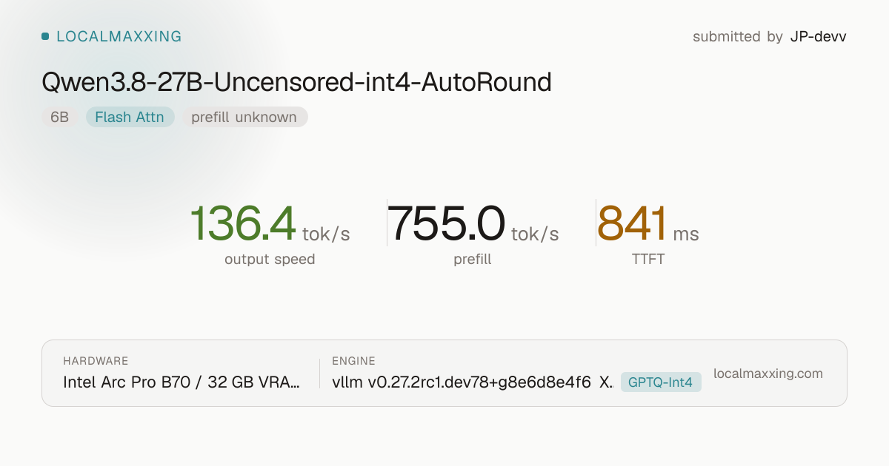
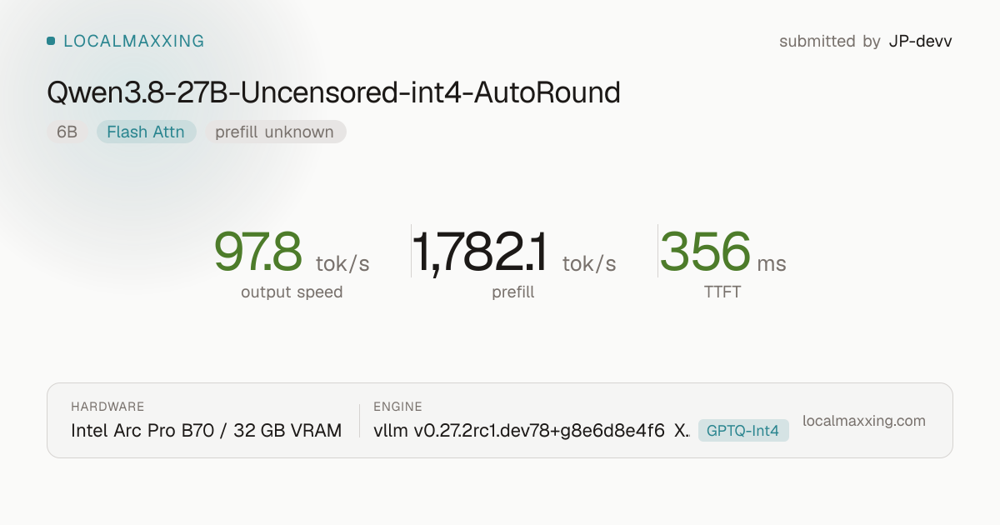
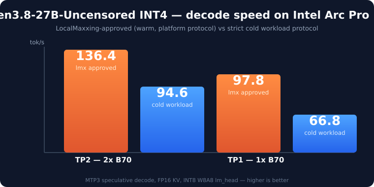

# humble-b70-llm

Reproducible, quality-gated inference of **Qwen3.8-27B-Uncensored INT4** on
**Intel Arc Pro B70** — the exact stack that runs on this lab's production
machine, shipped as patches + build scripts + measured evidence.

The goal of this repository is that a stranger who clones it, reads it, and
follows `QUICKSTART.md` lands on the same numbers we publish — not because of
faith, but because everything that affects the result is pinned or measured.

## LocalMaxxing-approved speeds (headline)

Decode rate as measured by the LocalMaxxing platform (their protocol —
warm-up request, then a median of 3 greedy iterations, client post-first):

| Config | Decode (tok/s) | TTFT | tokSPrefill | Submission |
| --- | ---: | ---: | ---: | --- |
| **TP2 — 2x Intel Arc Pro B70** | **136.4** | 841 ms | 755 | `cmt0vu76q0fvtms017exhssx9` APPROVED |
| **TP1 — 1x Intel Arc Pro B70** | **97.8** | 356 ms | 1782 | `cmt0vrxjk0fvpms01n4i9cmns` APPROVED |

<p>
  
  
</p>

Model: `johannrplaster/Qwen3.8-27B-Uncensored-int4-AutoRound`
(Qwen3.8-27B uncensored variant, AutoRound INT4 W4A16 g128, MTP head
preserved, linear-attention projections kept FP16). Stack: MTP3 speculative
decode, FP16 KV, load-time **INT8 W8A8 lm_head**, host-staged TP2 collectives
(no peer-to-peer required).

The platform protocol measures warm, repeating traffic. A stricter, one-shot
picture of the same stack — what a fresh user request actually experiences —
is under the [cold workload speeds](#cold-workload-speeds-strict-one-shot-protocol)
below.

## Cold workload speeds (strict one-shot protocol)

The same stack measured cold: each prompt sent once, prompt/KV caching off,
`cached_tokens=0` verified, median inter-token rate over tokens 1-100 after
TTFT (the in-repo harness, contract in
[docs/metrics-contract.md](docs/metrics-contract.md)).



| Serving config | Decode (tok/s, cold) | Evidence |
| --- | ---: | --- |
| 2x B70 (TP2), MTP3, FP16 KV, **INT8 LM head** | **94.58** | [json](bench/reference/tp2-mtp3-int8-head-94.58.json) |
| 2x B70 (TP2), MTP3, FP16 KV, stock FP16 head | 81.81 | [json](bench/reference/tp2-mtp3-fp16-head-81.81.json) |
| 1x B70, MTP3, FP16 KV, **INT8 LM head** | **66.84** | [json](bench/reference/tp1-mtp3-int8-head-66.84.json) |

The INT8 LM head (W8A8, quantized at load) is the key optimization:
**+15.6% decode with quality gates unchanged.** How and why it works is in
[docs/optimizations.md](docs/optimizations.md) — including the things that
did *not* work and were rejected with data.

Why the two classes differ: warm, repeated, same-shape requests let clocks,
allocators, and graph dispatch reach steady state; cold requests pay
first-touch costs. Both numbers are real; they describe different traffic.
The [metrics contract](docs/metrics-contract.md) makes the boundary explicit.

## Quickstart (target: ~45 minutes to a verified server)

(Reproduction target is the cold row: `94.58 ± tolerance` TP2 / `66.84` TP1
via `bash scripts/bench-strict.sh`; the LocalMaxxing rows above come from the
platform's own warmed protocol and are re-verifiable with the `lmx` CLI
against the same server.)

```bash
# 1. host drivers (one-time, needs sudo + reboot on some systems)
bash scripts/setup-host.sh

# 2. build the stack (venv + vLLM patches + kernels wheel)
bash scripts/build.sh

# 3. fetch the model (18 GB) and verify it byte-for-byte
bash scripts/model.sh fetch
bash scripts/model.sh verify

# 4. serve
bash scripts/serve.sh           # TP2 by default; scripts/serve.sh --tp 1 for one card

# 5. prove it works the way we measure it
bash scripts/verify-install.sh  # ops registered + canary + smoke
bash scripts/bench-strict.sh    # cold-suite -> compare against bench/reference/
bash scripts/quality-gate.sh    # must show the arithmetic/code canaries passing
```

Expected outcome: a `94.58 ± tolerance` tok/s TP2 run and a passing quality
gate, with the same number you can re-derive from the reference JSONs.

## The three things this repo does differently

1. **The patches are the running state.** `patches/` contains the exact
   source deltas that production runs, generated from live trees against
   pinned upstream commits ([vllm](patches/vllm/BASE_COMMIT.txt),
   [kernels](patches/vllm-xpu-kernels/BASE_COMMIT.txt)). Clone + apply +
   build == what produced the numbers.
2. **Binaries are self-tested, not hash-gated.** Ahead-of-time SYCL builds
   differ by toolchain; we never hard-check AOT hashes. `verify-install.sh`
   registers ops, runs a smoke generation, and checks the deterministic
   canary (`sum(i*i for i in range(4))` must answer `14`).
3. **Every number carries its contract.** A warm, repeated, same-shape
   benchmark of this stack reads much higher than a cold fresh-response
   number — the difference is the measurement, not the machine. The
   [metrics contract](docs/metrics-contract.md) and
   [methodology lesson](bench/reference/methodology-lesson-alternative-stack-cold.json)
   make that difference explicit instead of hidden.

## Hardware notes (read before buying/borrowing)

### Minimum requirements per result (cold-workload rows, same hardware serves the LocalMaxxing rows)

| Result (tok/s, cold) | Minimum hardware | Notes |
| --- | --- | --- |
| 94.58 (TP2 INT8) | 2x B70 32 GB + ReBAR | Second slot can be PCIe x4 or x16 — the reference machine runs the
  second card at x4 and reproduces this row. Same host minimums as below.
  No peer-to-peer required. |
| 81.81 (TP2 FP16) | 2x B70 32 GB + ReBAR | Same as above; difference is only the `INT8=off` flag. |
| 66.84 (TP1 INT8) | 1x B70 32 GB + ReBAR | Any working PCIe slot. Complete, supported configuration. |

Host minimums for **building and reproducing** any row (in addition to the
single listed GPU):

- **OS:** Ubuntu-family Linux (26.04 tested; Debian-family likely).
- **RAM:** 64 GB recommended; the SYCL kernel build peaks at 7-12 GB per
  compile job (6 jobs by default). 32 GB works with `MAX_JOBS=3` and the
  reduced attention presets but is not validated in this repo.
- **Disk:** ~90 GB free (toolchain + 18 GB model + build tree).
- **Driver:** a Battlemage-capable `xe` kernel line + Intel compute runtime
  (exact versions and verification in [docs/drivers.md](docs/drivers.md)).
- **GPU:** Arc Pro B70 (32 GB) is the only verified GPU. Other Arc/XPU
  variants are unverified and will not necessarily reproduce these rows.

### Notes

- **No GPU peer-to-peer required.** TP2 works via host-staged collectives
  (in the patch set) on motherboards without P2P routing. With working
  peer IPC the same patches run faster; without it, they still run and
  reproduce.
- See [docs/hardware.md](docs/hardware.md) for the full truth table,
  BIOS/ReBAR requirements, and power findings.

## Repository map

```text
patches/          source deltas vs pinned upstream (vllm, vllm-xpu-kernels)
scripts/          setup-host / build / serve / bench / quality / verify
bench/            the exact harness + reference evidence
docs/             hardware, drivers, metrics contract, optimizations, attempts, troubleshooting
```

## License and provenance

Apache-2.0. All third-party bits are upstream open-source (vLLM,
vllm-xpu-kernels, oneDNN, oneCCL); attributions are kept generic in-repo.
The model and its derived versions are Apache-2.0.
